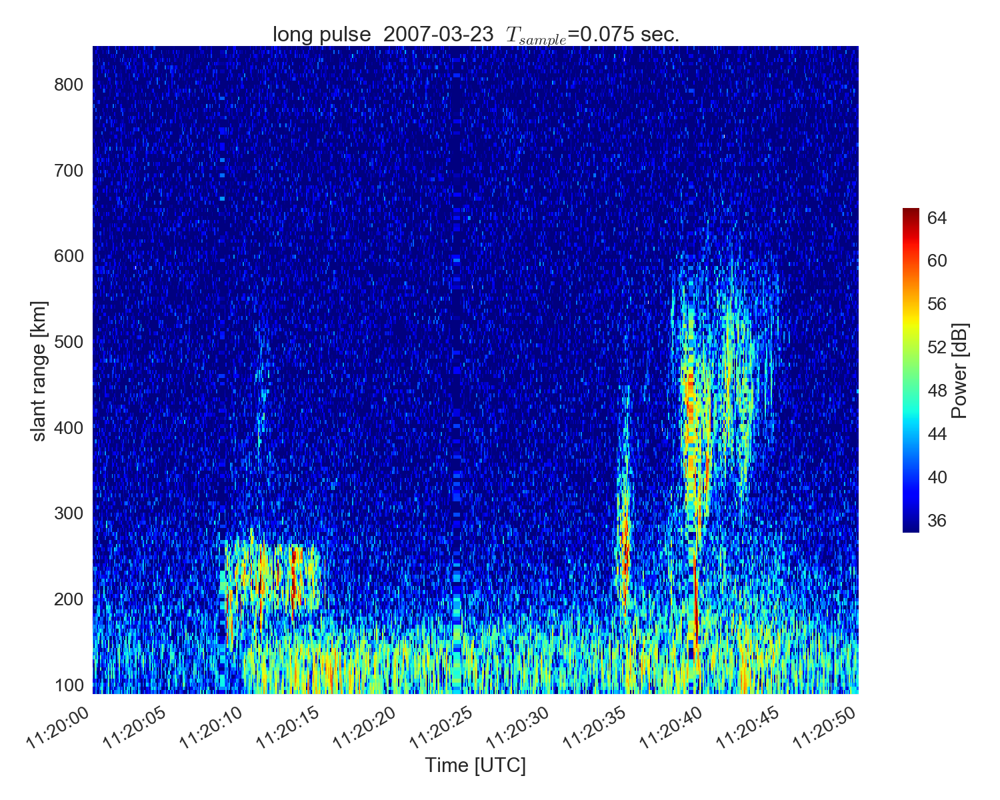
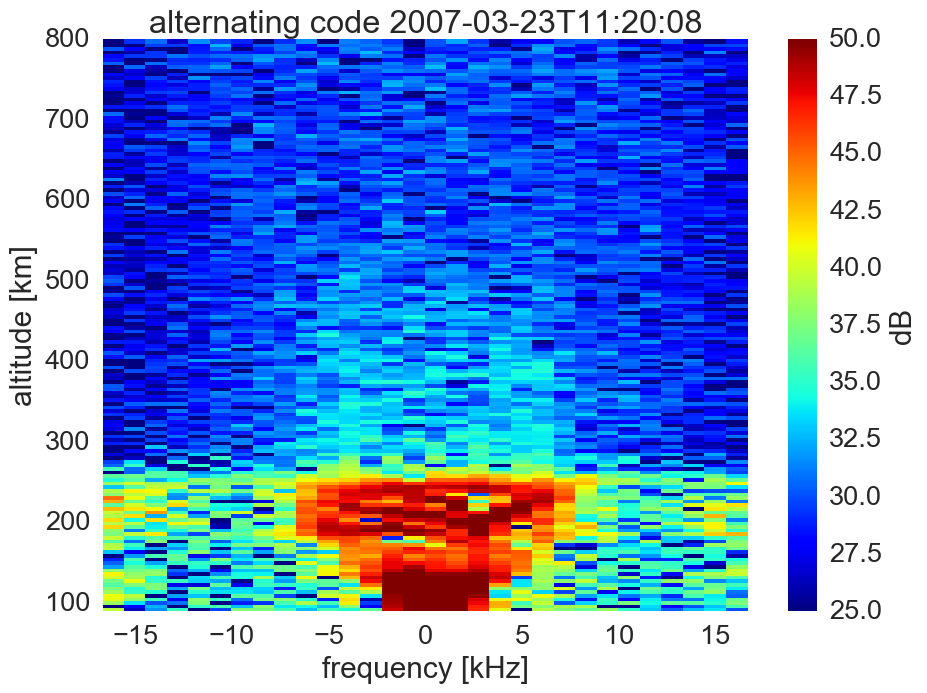
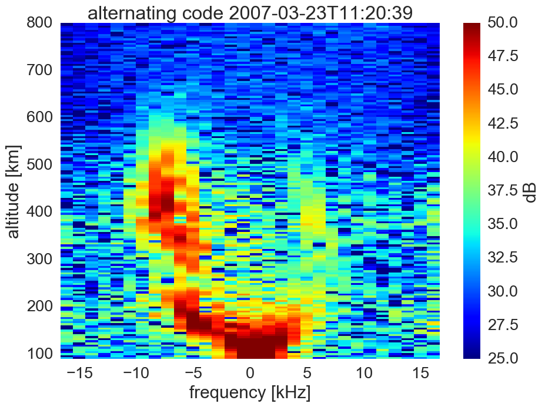

.. image:: https://zenodo.org/badge/DOI/10.5281/zenodo.164876.svg
   :target: https://doi.org/10.5281/zenodo.164876

.. image:: https://travis-ci.org/scivision/isrutils.svg?branch=master
    :target: https://travis-ci.org/scivision/isrutils
.. image:: https://coveralls.io/repos/github/scivision/isrutils/badge.svg?branch=master
    :target: https://coveralls.io/github/scivision/isrutils?branch=master

========================
AMISR raw data utilities
========================
Utilities for working with Incoherent Scatter Radar data, especially from Poker Flat AMISR.

We work with the complex I+jQ voltage samples, the lowest level data available from the radar, on a single pulse basis.
Depending on the beam pattern and pulse modulation, the per-beam pulse cadence is perhaps on the 75 milliscond time scale.

Coming soon, simultaneous plots with high speed multi-camera synchronized video.

.. contents::

Install
=======
::

    python setup.py develop

Usage
=====
``singleplot.py`` is a main program used to examine raw ISR data.
It's configured via ``.ini`` files.
Some important parameters are:

============ =======================
parameter    description
============ =======================
scan          CFAR detection of turbulent activity (possible association with Alfven waves)
tlim          unless scan=yes, usually you use tlim to only plot over time range of interest (to avoid enormous amount of plots)
============ =======================

Examples
========
From the Akbari GRL 2012: Anomalous ISR echoes preceding auroral breakup:
Evidence for strong Langmuir turbulence  doi:10.1029/2011GL050288

.. image:: gfx/Akbari2012_fig3b.png
    :scale: 40 %
    :alt: Figure 3b Akbari 2012

File Types
==========
Currently, raw ISR data files are *not* currently contained on `Madrigal <http://isr.sri.com/madrigal>`_, you will have to email SRI staff to get them manually.

When requesting raw AMISR data, please `request by experiment name <http://amisr.com/database/61/sched>`_ as this is more convenient for SRI staff than the date/time.

Here is a limited selection of `raw ISR data <https://bit.ly/pokerhist>`_.
It is indexed by date; under each date look for the ISR folder. You will typically want to download all four file types noted in the table below.

===========   ==================
File ext.      Data Type
===========   ==================
dt0.h5        Ion Line: Alternating Code
dt1.h5        Downshifted Plasma line (negative Doppler shift)
dt2.h5        Upshifted Plasma line (positive Doppler shift)
dt3.h5        Ion Line: Long Pulse (small Doppler )
===========   ==================

Discussion
==========

The "ion line" measurement bandwidth is ~ +/- 100 kHz from the radar center frequency, and contains the data necessary for volume estimates of Electron Density, Ion Temperature, Electron Temperature, and Ion Velocity,
under certain assumptions for species composition vs. altitude. Some of the need to make assumptions about atmospheric composition can be mitigated with combined ion/plasma line inversion, among numerous other benefits.
The plasma line returns have several MHz of bandwidth, but most of the energy is contained in narrower bands upshifted and downshifted from the center frequency.

No one radar waveform is optimal for all conditions, particularly with regard to the spatio-temporal sampling dilemma.
Incoherent scattering from tiny particles gives exceedingly weak returns, and even with many billions of particles in the scattering volume, it takes well over ten thousand radar pulses to build a statistical basis for a usable autocorrelation function (ACF).
The shape of the ACF is fitted to estimate certain plasma parameters, given assumptions on the particle population that may be violated, causing in some limited
sets of cases either inaccurate fits or a failure to estimate the parameters.

References
==========
.. [1] H. Nilsson et al. `"Enhanced incoherent scatter plasma lines", Annales Geophysicae, 1997 <http://dx.doi.org/10.1007/s00585-996-1462-z>`_
.. [2] E. Kudeki and M. Milla "Incoherent Scatter Radar — Spectral Signal Model and Ionospheric Applications", 2012, in:  Doppler Radar Observations - Weather Radar, Wind Profiler, Ionospheric Radar, and Other Advanced Applications, Dr. Joan Bech (Ed.), ISBN: 978-953-51-0496-4, InTech, DOI: 10.5772/39010. <http://www.intechopen.com/books/doppler-radar-observations-weather-radar-wind-profiler-ionospheric-radar-and-other-advanced-applications/incoherent-scatter-radar-spectral-measurements-and-ionospheric-applications>`_
.. [3] H. Akbari et al
